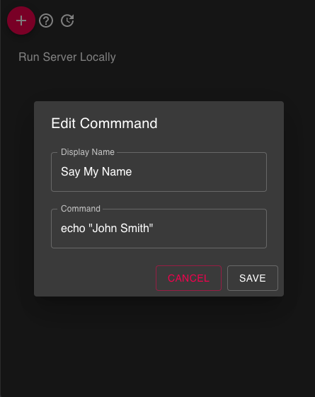
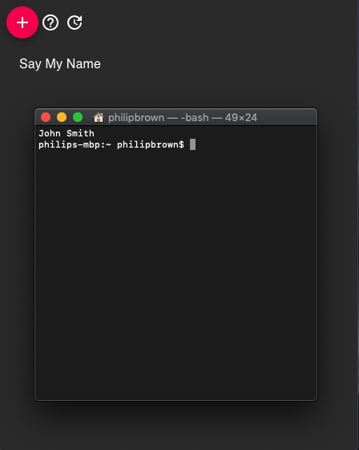

# exec

Desktop Application for managing and executing commonly used terminal commands

## Overview
* Exec is a utility app for saving commonly used terminal commands in a easily accessible list that can be executed quickly.
* Each time a command is executed it will simply open a CLI (terminal) window and execute the command for you.

## Features Roadmap
- [ ] Command Arguments (Free form and option based)
- [ ] Import and Export Lists
- [ ] Drag and Drop Organizing
- [ ] Command List Groups
- [ ] Optional Headless command execution (Runs in the background instead of a terminal window)

## Download
* Download the latest release for mac from the [relases](https://github.com/pwbrown/exec/releases/latest) page

## Building Manually

### Install Node.js - Skip if already installed
1. Install "nvm" - [install steps](https://github.com/nvm-sh/nvm#installation-and-update)
2. Open a new terminal and run `nvm install 10` to install node.js v 10

### Build the App Locally
1. Clone/Download the repository
2. Open a terminal and navigate to the root of the project
3. Run `npm install`
4. Run `npm run-script build`
5. Open a File Explorer and navigate to the "artifacts" folder generated at the root of the app and choose the appropriate executable.

### Screenshots

***

Click to view.

