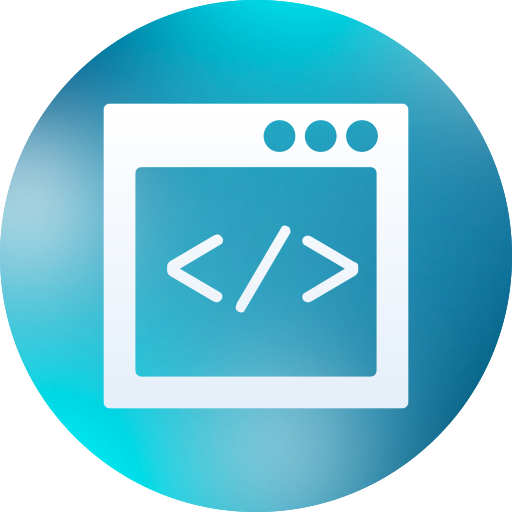
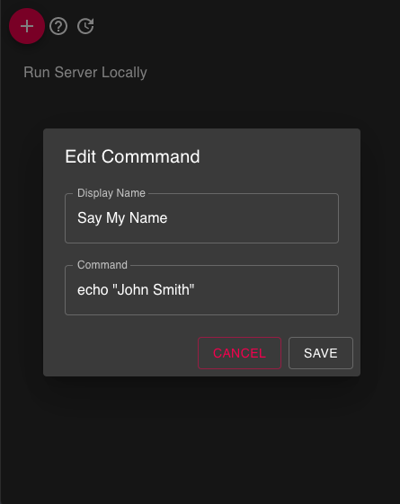
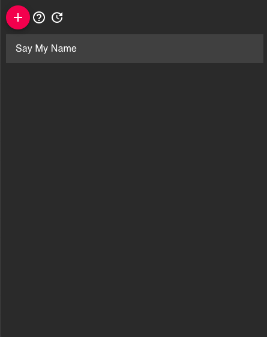
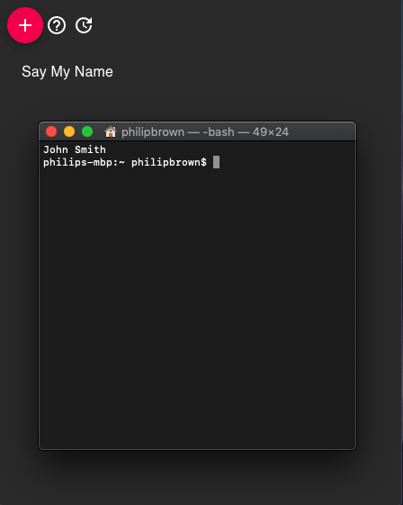

# exec

Desktop Application for managing and executing commonly used terminal commands

## Building

### Install Node.js - Skip if already installed
1. Install "nvm" - [install steps](https://github.com/nvm-sh/nvm#installation-and-update)
2. Open a new terminal and run `nvm install 10` to install node.js v 10

### Build the App Locally
1. Clone/Download the repository
2. Open a terminal and navigate to the root of the project
3. Run `npm install`
4. Run `npm run-script build`
5. Open a File Explorer and navigate to the "artifacts" folder generated at the root of the app and choose the appropriate executable.

## Upcoming Goal Tracking
- [x] Integrate with Github Actions(Beta)
- [x] Automate build releases for Mac
- [x] Enable Auto Updating within the app

### Screenshots

***

Click to view.

